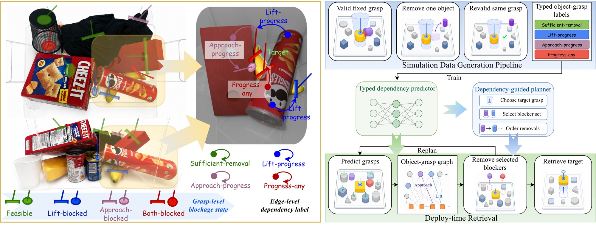

# GCDG

**Minimal-Intervention Target Retrieval in Cluttered Scenes with Grasp-Conditioned Dependency Graphs**

Wanhao Niu\*, Qiyan Ke\*, Yuan Sun, Chongrui Zhang, Huaidong Zhou†, Yongfeng Rong, Shuang Zhang, Fuchun Sun†  
\* Equal contribution. † Corresponding authors.

[Project page](https://wanhaoniu.github.io/GCDG/) · [Paper](docs/assets/paper.pdf) · [Benchmark](benchmark/README.md) · [Downloads](https://huggingface.co/datasets/WanhaoX25/GCDG-Benchmark) · [中文说明](README_ZH.md)



GCDG predicts **which surrounding objects block a particular target grasp**, with separate approach, lift and sufficient-removal labels. A short-prefix planner chooses a grasp, removes predicted blockers and replans after each intervention.

This repository contains the **CoRL** method and benchmark. It does not contain the separate T-RO dynamic-hypergraph project.

## Benchmark

The dense benchmark contains **500 scenes**, **12,985 scene–target samples**, **313,228 grasp candidates** and **6,766,097 supervised object–grasp edges**. Both parallel-jaw and suction candidates are included.

| Split | Scenes | Targets |
|---|---:|---:|
| Train | 350 | 9,090 |
| Validation | 75 | 1,950 |
| Test | 75 | 1,945 |

The release includes scene configurations, grasp proposals, dependency labels, minimal blocker sets, fixed splits, 29 learned-model checkpoints, and evaluation records. Prediction uses seeds 7, 11 and 23. Ordered retrieval additionally includes seeds 31 and 43. See the [data card](benchmark/README.md) for schema, tasks, licenses and scope.

## Quick start

Python 3.10+ is required. Install a PyTorch build suitable for your machine, then:

```bash
git clone https://github.com/wanhaoniu/GCDG.git
cd GCDG
python -m pip install -e .
python -m unittest discover -s tests -v
python scripts/recount_ordered.py
```

Read the included graph fixture without a simulator or grasp SDK:

```bash
python scripts/inspect_sample.py --dataset examples/benchmark
```

Download the benchmark, or select just one split:

```bash
python scripts/download_benchmark.py --split all --output data --extract
```

Download `gcdg-models.tar.gz` from the [model release](https://github.com/wanhaoniu/GCDG/releases/tag/v1.0.0) and extract it at the repository root. The archive creates `weights/`.

### Evaluate a learned predictor

```bash
python scripts/prediction.py evaluate \
  --config configs/prediction/ours_seed7.json \
  --dataset data/benchmark \
  --checkpoint weights/ours_seed7/checkpoints/best.pt \
  --calibration weights/ours_seed7/calibration_thresholds.json \
  --output outputs/ours_seed7_test --device cuda
```

Use the corresponding config, checkpoint and calibration for Edge-MLP, G2N2-style, ObjectOnly and each ablation. `--device cpu` is supported. The G2N2 comparison is the paper's **adapted G2N2-style baseline**, implemented for the common dependency interface, rather than the upstream authors' full robot system.

### Train

```bash
python scripts/prediction.py train \
  --config configs/prediction/ours_seed7.json \
  --dataset data/benchmark --output outputs/ours_seed7_train --device cuda
```

Training uses only the released train and validation splits. It selects the checkpoint by validation progress AP and calibrates each label threshold on validation data. Test evaluation is a separate command. The recipe uses 45 epochs, batch size 32 and AdamW with learning rate 0.001 and weight decay 0.0001.

### Planning and closed-loop simulation

See [reproduction instructions](REPRODUCING.md). Stored-label planning uses the released graph annotations and prediction scores. Fresh-observation closed-loop simulation additionally requires the external object assets and separately installed grasp proposal backends described in [THIRD_PARTY.md](THIRD_PARTY.md).

## Results

Dependency prediction on the fixed test split, mean ± sample standard deviation over three seeds:

| Method | AP (%) | F1 (%) | Blocker IoU (%) |
|---|---:|---:|---:|
| Edge-MLP | 31.5 ± 0.5 | 37.3 ± 0.4 | 24.8 ± 0.3 |
| G2N2 | 38.3 ± 0.5 | 42.2 ± 0.5 | 29.3 ± 0.3 |
| GCDG | **40.0 ± 0.3** | **43.5 ± 1.1** | **30.7 ± 1.1** |

All 20 camera-ready tables are available as [CSV and TeX](results/tables/), including complete baseline and ablation results.

In physical single-target retrieval, GCDG retrieves **131/256** targets with **2.53** mean non-target removals; the X-Ray adapter retrieves **124/256** with **3.36**. These trials use the same 256 targets in ten dense test scenes.

Ordered retrieval uses **four development scenes**, each with 15 objects and four target orders: 16 sequences and 160 designated target trials per condition. The paper's representative Ours model is seed 11: 137/160 retrieved and 183 relocations; X-Ray: 129/160 and 281 relocations. Seed 11 was selected post hoc among five models on the original-order development runs, then fixed before the added orders. All five seeds, failures and unattempted targets remain in the [episode ledger](results/ordered/episodes.csv). The additional orders reuse the same four scenes.

## Layout

```text
benchmark/                 fixed splits, data card, download checksums, protocols
configs/                   frozen prediction, planning and simulation settings
src/grasp_dependency_dataset/  graph features, labels, networks, simulation adapters
src/grasp_pose_generator/   interfaces to separately installed proposal backends
planners/                  dependency-guided and comparison planners
fresh_mujoco_closed_loop/   common closed-loop execution interface
scripts/                   download, inspection, training, evaluation and recount
results/                   all tables and evaluation records
paper/figures/             accepted camera-ready figures
docs/                      GitHub Pages project website and paper
```

## License and acknowledgments

Self-owned code is released under [MIT](LICENSE). Original benchmark annotations and result data are [CC BY 4.0](benchmark/LICENSE.md). Third-party assets, SDKs and their weights retain their own terms; see [THIRD_PARTY.md](THIRD_PARTY.md). No machine license, credential or proprietary SDK binary is included.

Supported by the Beijing Natural Science Foundation (Nos. L233006 and L253006), and the Joint Funds of the National Natural Science Foundation of China (No. U22A2057).

Contact: [Huaidong Zhou](mailto:hdzhou@tsinghua.edu.cn), [Fuchun Sun](mailto:fcsun@tsinghua.edu.cn).

## Citation

```bibtex
@misc{niu2026gcdg,
  title={Minimal-Intervention Target Retrieval in Cluttered Scenes with Grasp-Conditioned Dependency Graphs},
  author={Niu, Wanhao and Ke, Qiyan and Sun, Yuan and Zhang, Chongrui and Zhou, Huaidong and Rong, Yongfeng and Zhang, Shuang and Sun, Fuchun},
  year={2026},
  howpublished={CoRL camera-ready manuscript and software release},
  url={https://github.com/wanhaoniu/GCDG}
}
```
